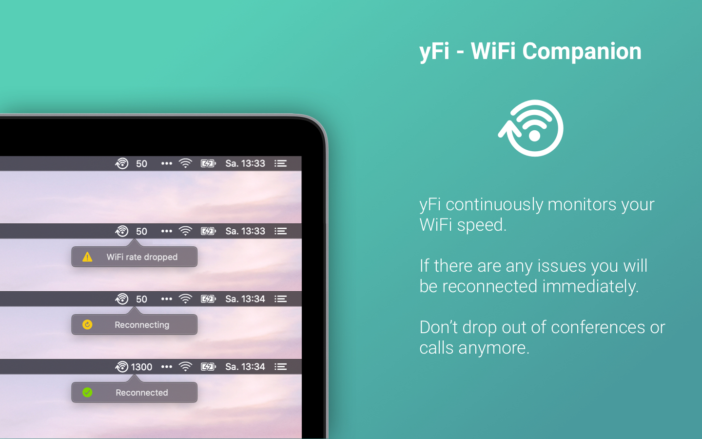

# yFi App

*yFi* is a simple app to make sure you stay connected and don't drop out. Checkout [the yFi website](https://yfi.coderose.io) for more details!

## Development

1. Make sure you have [Carthage](https://github.com/Carthage/Carthage) installed.
2. After initial checkout, run `carthage update`.
3. Open the project in Xcode and hack around.

## Credits

*yFi* uses the following libraries:

* [sindresorhus/LaunchAtLogin](https://github.com/sindresorhus/LaunchAtLogin)
* [sindresorhus/Defaults](https://github.com/sindresorhus/Defaults)

